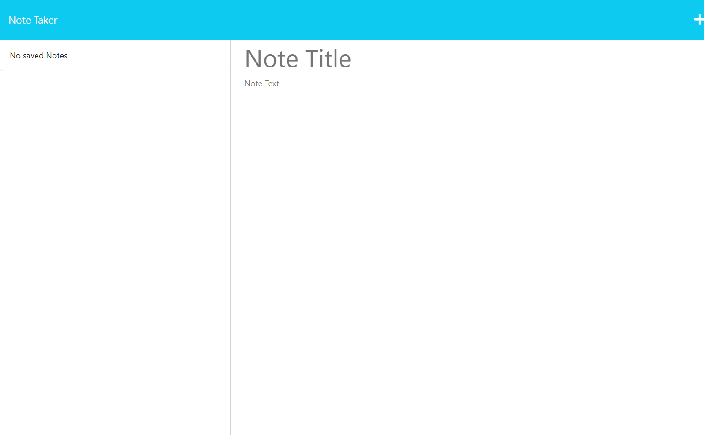
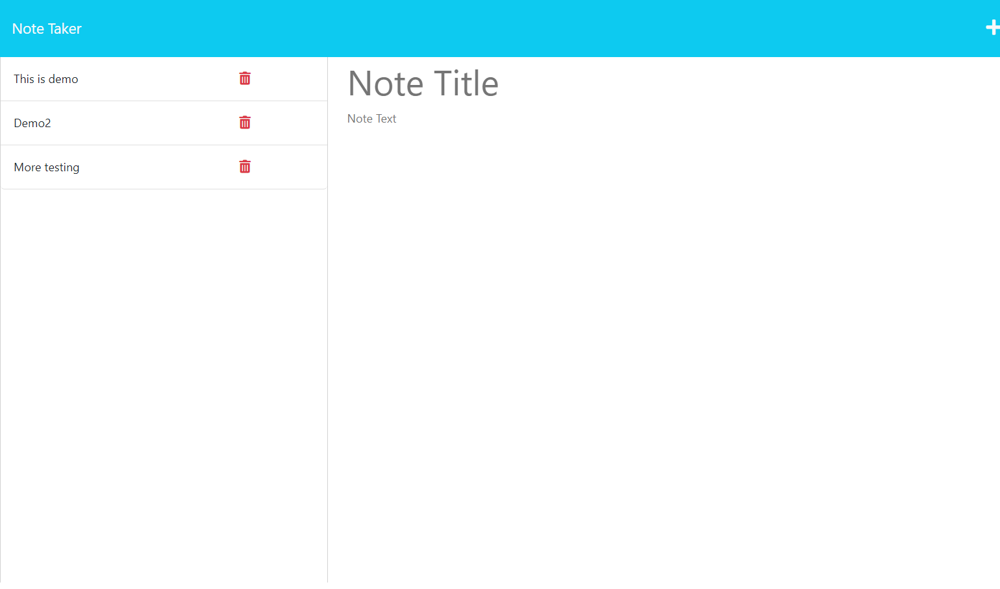

# note-taker

## Description

The Note Taker is a front end application built using JavaScript (Node.js and Express) and Object Oriented Programming. This program is designed to create a simple note taker in a web browser in order to keep track of your lists and ideas. A note takcer is an essential component of any practical or creative endeavour, providing the user with the ability to document and retain their ideas and plans for whatever they are working on. With this application, you no longer need to spend time manually writing down your notes. Through simple mouse and keyboard usage you can quickly generate many notes.

## Installation

User will need Node.js as well as the inquirer collection for command line user interfaces. Please follow the following links for documentation and instruction:

https://www.npmjs.com/package/inquirer#documentation

https://coding-boot-camp.github.io/full-stack/nodejs/how-to-install-nodejs

Heroku is also needed:

https://devcenter.heroku.com/articles/getting-started-with-nodejs?singlepage=true

## Usage

The URL of the GitHub repository: https://github.com/jrtvick/note-taker.git

The URL of the deployed Heroku link: https://note-taker-jrtvick.herokuapp.com/

## Credits

Tutorial Links:

https://nodejs.org/en/download

https://www.npmjs.com/package/inquirer#documentation

https://expressjs.com/en/guide/routing.html#express-router

https://coding-boot-camp.github.io/full-stack/nodejs/how-to-install-nodejs

https://coding-boot-camp.github.io/full-stack/github/professional-readme-guide

https://www.freecodecamp.org/news/svg-rectangle-and-other-svg-shapes/#:~:text=An%20SVG%20drawing%20can%20use,Line%2C%20Polyline%2C%20and%20Polygon

## License

MIT License

Copyright (c) 2023 Tyler Vick

Permission is hereby granted, free of charge, to any person obtaining a copy
of this software and associated documentation files (the "Software"), to deal
in the Software without restriction, including without limitation the rights
to use, copy, modify, merge, publish, distribute, sublicense, and/or sell
copies of the Software, and to permit persons to whom the Software is
furnished to do so, subject to the following conditions:

The above copyright notice and this permission notice shall be included in all
copies or substantial portions of the Software.

THE SOFTWARE IS PROVIDED "AS IS", WITHOUT WARRANTY OF ANY KIND, EXPRESS OR
IMPLIED, INCLUDING BUT NOT LIMITED TO THE WARRANTIES OF MERCHANTABILITY,
FITNESS FOR A PARTICULAR PURPOSE AND NONINFRINGEMENT. IN NO EVENT SHALL THE
AUTHORS OR COPYRIGHT HOLDERS BE LIABLE FOR ANY CLAIM, DAMAGES OR OTHER
LIABILITY, WHETHER IN AN ACTION OF CONTRACT, TORT OR OTHERWISE, ARISING FROM,
OUT OF OR IN CONNECTION WITH THE SOFTWARE OR THE USE OR OTHER DEALINGS IN THE
SOFTWARE.

---